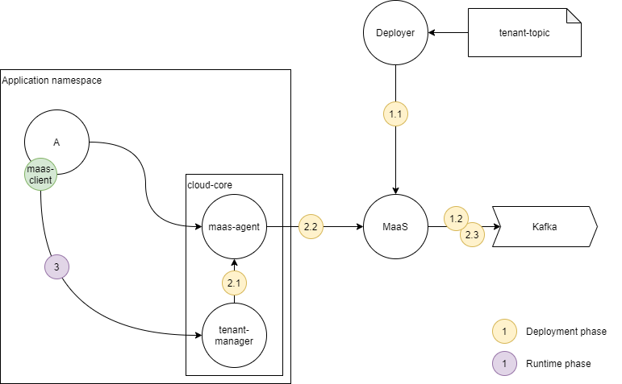

# Kafka templates, lazy topics, tenant topics
You can create your `templates` with necessary properties and then just mention it during topic or lazy-topic creation instead of describing properties. Adding a new template to MaaS doesn't trigger any topic creations. The main purpose of this entity is to reduce configuration repetitions during topic definitions. The link to the template is stored to derived topics. So, when you change original template parameters, it triggers new value propagation to all linked topics. Template parameters have higher priority over parameters declared on target entities. The api is described in api doc.

Another feature is `lazy-topic` - postponed creation of topic. You can think of it like a request of topic creation, which is stored in MaaS DB and could be triggered by corresponding api endpoint only by classifier. It could be useful if you want to describe topic beforehand using declarative approach and then just create it by name in your code.
Lazy topic is an entity stored in register of maas, defining lazy topic does not create anything in Kafka
Main feature of lazy topic is that you can define topic with partially-filled classifier (e.g. `{ "name" : "my-topic", "namespace" : "my-namespace" }` ) with all proper configurations
Then you can create topic by lazy topic (see api below) only with fully-filled classifier, adding for example tenantId (e.g. `{ "name" : "my-topic",  "namespace" : "my-namespace", "tenantId" : "123" }` )
And topic will be created with fully-filled classifier but with configs from lazy topics.
The api is also described in api doc.

`tenant-topic` - MaaS's entity, which is linked to tenants of a particular namespace. So you can declare tenant-topic (it is similar with lazy topic, only request of topic creation is stored) and for every tenant in your namespace (new or which were already activated) topic will be created with parameters and classifier you declared in tenant-topic, but classifier will have one more field - `tenantId` with externalId of concrete tenant. So every active tenant will have a topic defined by tenant-topic.
Note! If tenant is deactivated or deleted, topics assigned to this tenant will stay intact. No topic deletion will be performed.

To use `tenant-topic` feature in your namespace you should have Cloud-Core version `6.32` or later.
Otherwise, tenant-topics could be created in maas, but no tenants would be synchronised and therefore no real topic will be created for any tenant (until you update Cloud-Core, during rolling update for all existing activated tenants for every tenant-topic topic will be created)
Since Cloud-Core `6.32` tenant-manager have a task that sends ALL active tenants to maas-agent for every new active tenant. If maas-agent is configured to work with maas (Cloud-Core was deployed with necessary parameters) then maas-agent will synchronise all new tenants with tenant topics

## Tenant Topics How-To

MaaS offer special kind of topics called `tenant-topics`. These topics bonded with application tenants.
So, when tenant is created or deleted in application, MaaS will create or delete topics for these tenants.

## Process
Image below represents typical `tenant-topics` application scenario and parts involved in process:

Usually, developer declare `tenant-topic` entities in `deployments/maas-configuration.yaml`. These configuration files
will be processed on application deployment phase.

Deployment and using steps in detail:
* Steps 1.x - Application configuration during deployment time:
  * Step 1.1 - platform deployer send `maas-configuration.yaml` to MaaS. MaaS saves `tenant-topic` definitions to internal database
  * Step 1.2 - if application already have active tenants, then MaaS create topics in Kafka according `tenant-topic` definitions
* Steps 2.x Tenant lifecycle bindings with MaaS:
  * `tenant-manager` tenant activation process notify MaaS about newly created or deleted tenants. It trigger MaaS to create or delete topics in Kafka. Tenant activation process can be started in deployment time (for default tenant) or in runtime.
* Steps 3.x - Microservices working with Kafka topics, in general, can be divided on two parts: message producers and message consumers.
  * Message Producers - can use MaaS REST API and search for target topic using [rest_api.md#search-kafka-topics](rest_api.md#search-kafka-topics)
  * Message Consumers - also can use MaaS REST API topic search to subscribe, but also they need to watch for newly created/deleted tenants in runtime and update their subscription lists.

Steps 1.x are executed in application deployment time. Steps 2.x, 3.x are executed in application runtime time.
Note, that all interactions of application microservices with MaaS should be go through `maas-agent` microservice, that acts as
security proxy transforming application scoped M2M auth to Basic auth credentials specific for MaaS.

