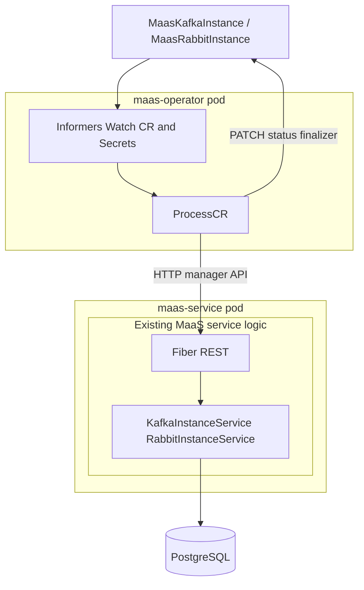
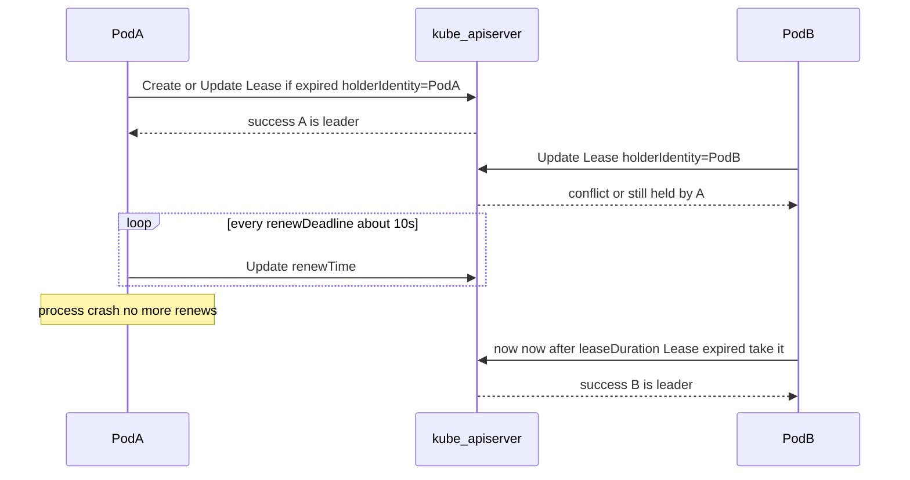
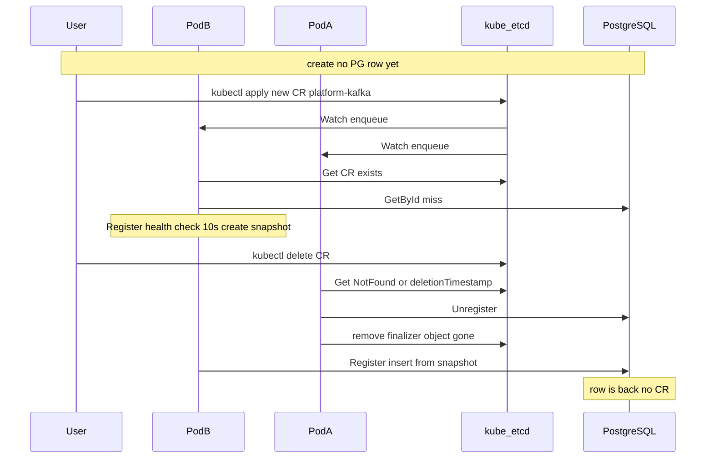
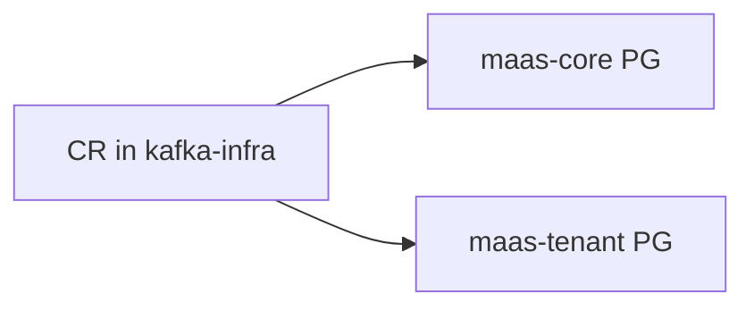
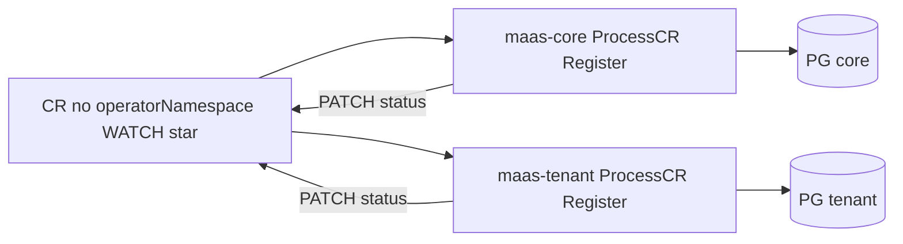
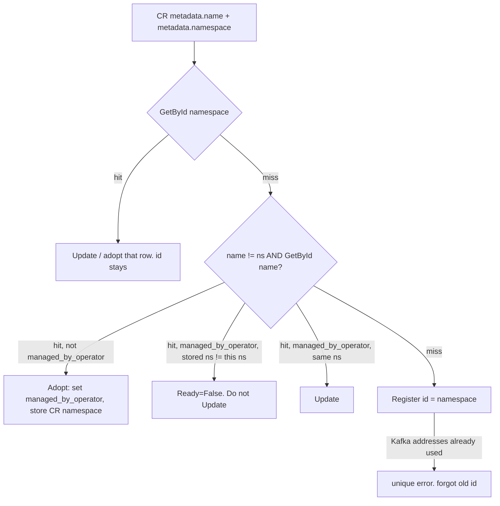

# Operator design notes

Background for the [broker-discovery operator design](operator_design.md). Not product design.

## Scenario A vs B recommendation

**Recommendation: B — sibling Deployment, same Helm chart, same image.**

Reasons that outweigh “just call the service in-process”:

- Least privilege: today’s [maas-service SA](../helm-templates/maas-service/templates/ServiceAccount.yaml) has no extra verbs. Cluster-wide CR + Secret read on the public API SA is a real multi-tenant risk.
- HPA already exists; embedding would require splitting “HTTP replicas” vs “operator replica” anyway.
- Operator can be optional (`OPERATOR_ENABLED: false`) without changing the HTTP process or its SA.
- Still one Go module: share mapping/validation code; do not duplicate instance business rules (always go through Register/Update/Unregister).

**When to choose A instead:** a hard requirement of “zero extra pods” and watch limited to the MaaS namespace (Role, not ClusterRole). Scaling then follows the design file — do not pin `REPLICAS: 1` just because the operator is in-process.

Do **not** have the operator write PostgreSQL directly.

The product design keeps the **single microservice** in `[operator_design.md](operator_design.md#single-microservice-reconciler-and-maas-logic-in-one-process)` (this file still calls that topology scenario A). This section is the comparison only.

### Scenario B — two microservices (ProcessCR in operator, MaaS logic in maas-service)

Operator Deployment in the same namespace, same image/chart, separate SA. `maas-service` stays the HTTP API and owns PostgreSQL.

**Apply path: manager REST.** The operator must not open the DB. ProcessCR runs in `maas-operator`; apply is GET/POST/PUT/DELETE `/api/v2/{kafka,rabbit}/instance`.



Operator waits until `maas-service` is ready. Apps talk only to `maas-service`. ProcessCR is **not** inside the MaaS service process; MaaS logic stays only in `msB`.

|                        | A. Embed in `maas-service`                                                                        | B. Sibling Deployment in same namespace (recommended)                     |
| ---------------------- | ------------------------------------------------------------------------------------------------- | ------------------------------------------------------------------------- |
| **HA (most important)** | Must add leader election to a process that did not have it; HPA scales HTTP and operator together | Own Deployment `replicas: 1` + Lease; HTTP HPA unaffected                 |
| Binary                 | Start controller-runtime alongside Fiber in `[server.go](../maas/maas-service/server.go)`         | Same module/image, second command e.g. `/app/maas operator`               |
| Register path          | **Scenario A:** in-process `KafkaInstanceService` / `RabbitInstanceService` (not localhost HTTP)  | **Scenario B:** manager REST `/api/v2/{kafka,rabbit}/instance`            |
| RBAC                   | ClusterRole (cluster watch) lands on the **HTTP** SA — over-privilege                             | ClusterRole only on `maas-operator` SA; HTTP SA unchanged                 |
| Failure isolation      | Watcher panic / client-go deadlock can take REST down                                             | Operator crash does not take MaaS API down                                |
| DR                     | Already has `drMode`                                                                              | Must read `EXECUTION_MODE` (or `/health`) and no-op when standby          |
| Helm                   | Flag on existing chart                                                                            | Same chart, optional template; disable = no operator objects              |
| Cost                   | Smaller ops surface                                                                               | Extra pod, manager credentials for the operator, readiness: wait for MaaS |
| Extraction later       | Harder (RBAC already on HTTP SA)                                                                  | Already extracted                                                         |

## Kubernetes Lease lock

This section explains how `coordination.k8s.io/v1 Lease` works so the design doc can stay short. The design uses one namespaced Lease named `maas-operator-leader`.

### What a Lease is

A Lease is a small namespaced API object. It is not a queue, not a MaaS DB row, and not a message bus. Kubernetes already uses the same kind for:

- kubelet node heartbeats (`kube-node-lease` in `kube-node-lease`)
- kube-scheduler and kube-controller-manager leader election

Typical spec:

```yaml
apiVersion: coordination.k8s.io/v1
kind: Lease
metadata:
  name: maas-operator-leader
  namespace: maas-core
spec:
  holderIdentity: maas-service-7f8c9d-xk2l   # who holds the lock
  leaseDurationSeconds: 15                   # how long a heartbeat stays valid
  acquireTime: "2026-08-25T11:00:00.000000Z"
  renewTime: "2026-08-25T11:00:12.000000Z"   # last heartbeat
  leaseTransitions: 3                        # how many times the holder changed
```

`holderIdentity` is whatever the client puts there. For MaaS it is the **pod name** (`POD_NAME` from the Downward API), not hostname.

Optimistic concurrency uses the object’s `metadata.resourceVersion`, the same mechanism as any other Kubernetes PATCH. Two pods cannot both store a new holder on version N; one write wins, the other gets 409 and retries.

### Acquire / hold / expire

`client-go` `leaderelection` (wrapped by `controller-runtime` `LeaderElection: true`) runs this loop on **every** replica that participates:



1. **Acquire.** `Get` the Lease. If missing, `Create` with `holderIdentity = myPod`. If present and **expired** (`now > renewTime + leaseDurationSeconds`), `Update` it to yourself. If present, not expired, and held by someone else: wait and retry. Concurrent Updates are serialized by `resourceVersion`.
2. **Hold.** The leader PATCHes `renewTime` about every `renewDeadline` (~10s). That is the heartbeat. As long as it lands before `leaseDurationSeconds` (~15s) elapses, nobody else may take the lock.
3. **Expire.** If the leader dies without releasing, `renewTime` goes stale. After `leaseDuration`, another replica’s Update succeeds. Until then **nobody** is leader — an idle gap, not two leaders. MaaS instance rows already sit in PostgreSQL, so the gap is idle reconcile, not data loss.
4. **Release on graceful stop.** `LeaderElectionReleaseOnCancel: true` updates the Lease on SIGTERM so the next pod can acquire without waiting the full 15s. `kill -9` / node death does not release; others wait for expiry.
5. **Expired ≠ deleted.** The Lease object stays. `leaseTransitions` increments each time a new holder wins (useful to debug flapping).
6. **Clocks.** Expiry is each client’s wall clock versus stored `renewTime`. Skew delays or hastens failover. It does not create two valid holders unless both Updates succeed, which the apiserver prevents.

Default timings (controller-runtime): `leaseDuration` 15s, `renewDeadline` 10s, `retryPeriod` 2s. Failover after hard kill ≈ 15s; after graceful stop ≈ 1–2s.

### Mapping onto the process

`LeaderElection` is **not** a kubelet or Pod field. It is a boolean we pass into `controller-runtime`. The library talks to the apiserver with the in-cluster ServiceAccount token (`/var/run/secrets/kubernetes.io/serviceaccount/`).

Callbacks:

- `OnStartedLeading` — this process starts CR/Secret informers and the reconciler (it is the watcher).
- `OnStoppedLeading` — stop informers immediately. HTTP (Fiber) stays up.

Until the first callback, and after the second, the replica is **not** a watcher even if it still serves `/api`.

Followers do **not** poll `spec.holderIdentity` in application code. They stay inside `mgr.Start` / `leaderelection.RunOrDie` on Get/Update of the Lease and never enter the leader branch.

### Where MaaS gets the values

Priority: env → `application.yaml` → defaults (same koanf pattern as `execution.mode`).

- `OPERATOR_ENABLED` — Helm → env. If false, do not start the manager; no Lease.
- Lease namespace — `CLOUD_NAMESPACE` (already Downward API `metadata.namespace` on `maas-service`).
- `holderIdentity` — `POD_NAME` (add Downward API `metadata.name`). Do not use hostname.
- Lease name — constant / config `maas-operator-leader`.
- `LeaderElection: true` — set in process when the operator is enabled.

Helm fragment:

```yaml
- name: OPERATOR_ENABLED
  value: "{{ .Values.OPERATOR_ENABLED | default false }}"
- name: POD_NAME
  valueFrom:
    fieldRef:
      fieldPath: metadata.name
```

Illustrative `controller-runtime` (Scenario A, inside [`server.go`](../maas/maas-service/server.go)):

```go
if !configloader.GetKoanf().Bool("operator.enabled") {
    return // HTTP-only; no Lease, no CR watch
}

ns := os.Getenv("CLOUD_NAMESPACE")
id := os.Getenv("POD_NAME")
leaseName := configloader.GetKoanf().String("operator.leader.lease-name")

cfg, err := rest.InClusterConfig()
mgr, err := ctrl.NewManager(cfg, ctrl.Options{
    LeaderElection:                true,
    LeaderElectionID:              leaseName,
    LeaderElectionNamespace:       ns,
    LeaderElectionReleaseOnCancel: true,
})
```

Equivalent explicit lock (identity must be the pod name):

```go
leaderelection.RunOrDie(ctx, leaderelection.LeaderElectionConfig{
    Lock: &resourcelock.LeaseLock{
        LeaseMeta: metav1.ObjectMeta{Name: leaseName, Namespace: ns},
        Client:    clientset.CoordinationV1(),
        LockConfig: resourcelock.ResourceLockConfig{Identity: id},
    },
    LeaseDuration: 15 * time.Second,
    RenewDeadline: 10 * time.Second,
    RetryPeriod:   2 * time.Second,
    Callbacks: leaderelection.LeaderCallbacks{
        OnStartedLeading: func(ctx context.Context) { /* start informers */ },
        OnStoppedLeading: func() { /* stop watching; HTTP stays */ },
    },
})
```

### What a Lease does not solve

- **Two MaaS installs** (two namespaces) each have their own Lease. That does not stop both from watching the same CR. Use `spec.operatorNamespace` + watch-namespace filter (design doc).
- **DR standby.** A standby pod may still hold the Lease. `EXECUTION_MODE` must still no-op writes.
- **409 on a CR PATCH** is a different object’s `resourceVersion` (finalizer/status). Unrelated to the Lease.

Human check: `kubectl get lease maas-operator-leader -n <maas-ns>`. Optional gauge `maas_operator_leader` (1 on holder, 0 otherwise) is **not** a lock — do not use it to decide who watches.

### How replicas know who is watching

1. **Every replica campaigns.** On startup (when `OPERATOR_ENABLED` and `drMode` allows starting the manager), each pod calls `Get`/`Create`/`Update` on that Lease. Identity in `spec.holderIdentity` is the **pod name** (`metadata.name`, already unique in the Deployment).
2. **Kubernetes serializes writers.** The apiserver + resourceVersion on the Lease is the lock. The first successful create/update wins. Other pods see `holderIdentity != me` (or a conflict) and stay in the wait loop. There is no MaaS-to-MaaS RPC, no DB row, no “watcher” flag in PostgreSQL.
3. **Callbacks, not polling inside the app.** `OnStartedLeading` → this process starts informers and the reconciler (the only replica that `Watch`es CRs). `OnStoppedLeading` → this process **stops** informers immediately (`LeaderElectionReleaseOnCancel: true` on SIGTERM). Followers never open a watch connection, so they cannot reconcile or patch CR status.
4. **Renewal is how you stay the watcher.** The leader heartbeats the Lease (`renewDeadline` ~10s, `leaseDuration` ~15s). If the leader dies without releasing, the Lease `renewTime` goes stale; another replica’s campaign succeeds after `leaseDuration`. Until then **nobody** watches — idle gap, not dual watchers. Registrations already sit in PostgreSQL.
5. **How a human (or metric) sees it.** `kubectl get lease maas-operator-leader -n <maas-ns> -o yaml` shows `holderIdentity` = watching pod. Export gauges: `maas_operator_leader` (1 on leader, 0 on followers) and log `became leader` / `lost leadership` at info. Optional: `/health` or actuator field `operator: leader|follower` for support, not for other pods to decide anything.
6. **What followers still do.** Fiber REST, health of brokers, discrepancy metrics, postdeploy as today. They do not list CRs, do not call `Register` from the operator path, do not write CR status.
7. **Rolling update / HPA.** New pods serve HTTP immediately and campaign. Old leader releases the lease on shutdown so failover is seconds, not `leaseDuration`. A brief overlap (old leader not yet dead, new already holding) is possible — another reason Register/Update must be idempotent. HPA adding a replica only adds another **campaigner**, not another watcher.
8. **DR standby.** Standby pods may still campaign so a lease exists, but `OnStartedLeading` must **not** start reconcilers when `EXECUTION_MODE` is not active. Watcher identity and “allowed to mutate” are independent: lease says who *may* watch; DR says whether that who *does*.
9. **Two MaaS in one cluster.** Each namespace has its **own** Lease. Replica A in `maas-core` cannot steal `maas-tenant`’s watcher role. Cross-install isolation is still `operatorNamespace` + watch namespaces, not this Lease.

**RBAC:** namespace Role on the existing `maas-service` SA: `get/list/watch/create/update` on `leases` in `coordination.k8s.io`. ClusterRole for CRs/Secrets (cluster watch); informers added only on the leader.

---

## Why several MaaS replicas watching the same CRs is a bug

PostgreSQL holds one Kafka/Rabbit instance list per MaaS. Register, Update, Unregister, and SetDefault all write that list. Two replicas that both Watch the same CRs both run ProcessCR on the same object. That is two writers on one registry.

When a CR changes, Kubernetes tells each watching pod: “run ProcessCR for this name.” It does not hand over a copy that stays valid until ProcessCR finishes.

The race is possible: pod B already read the CR while it still existed, then spends time on a broker health-check. Pod A deletes the CR and Unregisters. Pod B then Registers from the old read, without looking at the API again. PostgreSQL gets the instance back; the CR is already gone.

A Lease keeps one ProcessCR at a time. Without that, these cases happen.

**Case 1. Delete while the other pod is still Registering**

 User applies a new CR `platform-kafka`. There is no PG row yet. Both watching pods get a Watch event for that name. Watch does not pass a usable object; each ProcessCR **Gets** the CR from the API, then GetById, then Register (health-check, then insert).

1. Pod B Gets the CR (create, it exists). GetById is empty → Register. Health-check starts (can take seconds). Spec stays in memory for that call.
2. User runs `kubectl delete`.
3. Pod A Gets NotFound (or `deletionTimestamp`), Unregisters, removes the finalizer. CR gone, PG row gone.
4. Pod B’s health-check returns OK. It Registers from step 1 **without Get’ing again**. Insert succeeds. Status PATCH is NotFound (CR already gone). **PG has an instance with no CR.**




Two pods both handling the **same delete** (both Get Terminating, Unregister, remove finalizer) is **not** this bug. NotFound → Skip. Finalizer only after Unregister 200/404. Extra 409s and retries, not an orphan.

**Case 2. Two CRs / two pods and the default**

MaaS allows one default Kafka and one default Rabbit per database. First insert into an empty DB becomes default even if ProcessCR sent `default: false` (`ForcedDefault`). That “first” is whichever Register commits first — not a chosen id.

- Two replicas Register two new instance CRs at once: whichever insert lands first is default. Status `isDefault` on both CRs can disagree until the next Get. Lease keeps one ProcessCR at a time.
- Switching default is `MaasDefaultInstance` in the operator namespace, not `spec.default` on two instance CRs. Two pods both reconciling that singleton still flap `SetDefault` without a Lease; with a Lease it is one writer.

Update refuses `default: false` on the current default. Unregister refuses deleting the default while another instance exists.

- User deletes the current default instance while others remain: Unregister 400. The Default CR still names that id → `Ready=False` `InstanceNotFound` (or keep requeue until they point `spec.kafka` at another registered id). Do not clear the PG flag from the Default reconciler just because Unregister failed.

**Case 3. CR status does not match PostgreSQL**

Register of an id that already exists is **400 unique**, not Update.

Pod A Registers `platform-kafka` (Ready). Pod B also Registers the same id → 400. B PATCHes Ready=False (`HealthCheckFailed` or similar). The instance in PG is fine. The CR looks broken. B retries 400 until someone special-cases “already exists → Update.”

**Case 4. Two CRs, same `metadata.name`, different namespaces**

Both pods GetById, both see “name free,” both Register. One insert wins; the other hits PK. The losing CR may still show Ready if it then GETs the row and assumes it owns it. Adopt / `managed_by_operator` has the same check-then-write hole.

**Case 5. User is deleting (topics still there) while the other pod Updates**

Unregister returns 400 InUse; CR stays Terminating; finalizer stays. The other replica still has a live reconcile (Secret rotation or spec edit): it Updates, health-checks, and can **refresh credentials** on the instance the user is trying to remove. Not a revive; cleanup is blocked and the broker is poked again.

A Lease keeps one ProcessCR at a time.

---

## Comparison with DBaaS, core-operator, and nearby operators

### core-operator

Platform’s existing Kubernetes operator: a **separate Quarkus microservice** (not inside MaaS or DBaaS). Stack: `quarkus-operator-sdk` + fabric8 + java-operator-sdk. The published `core-operator` repo is a thin wrapper; MaaS/DBaaS/Composite reconcilers live in Maven `com.netcracker.core:core-operator`. Local additions include `SecurityReconciler`.

**What it already does with MaaS**

- CRD `kind: MaaS`, group `core.netcracker.com` / `core.qubership.org`, **Namespaced**, plural `maases`.
- `subKind: Topic` — same shape as [`service/cr`](../maas/maas-service/service/cr/dto.go) (`kind: maas`, `apiVersion: core.netcracker.com/v1`). Documented in this repo as [`custom_resources(CR).md`](custom_resources(CR).md).
- Reconcile: watch **current namespace only**, then **HTTP apply** to the product (`DeclarativeClient.apply` → `/api/declarations/v1/apply`). That is design **Scenario B**, already in production for topics/vhosts.
- Status: `phase`, `conditions` (`Converged`), `observedGeneration`.
- Auth to MaaS: projected SA token `audience: maas`.
- RBAC: **namespace Role** on those API groups, not ClusterRole.
- One core-operator **per application namespace**. Composite CR is applied there.
- Scaling: default `replicas: 1`; HPA scale-up **Disabled** unless `HPA_ENABLED`. Dual-watch is avoided mostly by staying at one replica.

**What it does not do:** register Kafka/Rabbit **broker instances**. Kind `MaaS` is entity declarations. No broker SecretRefs.

**Do not reuse `kind: MaaS` for broker instances** — core-operator already owns it. Keep `MaasKafkaInstance` / `MaasRabbitInstance` (`maas.netcracker.com`).

**Do not put instance discovery inside core-operator.** It runs in *app* namespaces and only watches that namespace. Broker CRs sit next to Kafka/Rabbit or next to MaaS. Putting discovery there would mean ClusterRole and every app operator racing to register platform Kafka.

**Copy:** namespaced Role+watch; status conditions; Scenario B = REST into MaaS; 202/retry reschedule (health-check requeue).

**Do not copy:** “replicas: 1 and hope”. `maas-service` already has HPA; Scenario A still needs a Lease.

### Why core-operator has no Lease

It is not that Kubernetes forbids it. They **do not run a singleton watcher role** the way MaaS would.

- Ops: default `replicas: 1`; HPA scale-up is `Disabled` unless `HPA_ENABLED`. One pod ⇒ one informer. No election needed.
- RBAC cannot elect anyway: the Role has **no** `coordination.k8s.io/leases`. ConfigMaps may be `create`d, but `update` is only allowed on the named CM `topology`. A lock object must be heartbeaten (`Update`). So they are not using Lease *or* ConfigMap leader election.
- Reconcile is **idempotent HTTP apply** of a Topic/DBaaS declaration. If someone did scale to 2, both pods would Watch and both POST `/apply`. MaaS `onEntityExists: merge` converges to the same topic. Waste and CR status last-writer-wins, not “two defaults / Unregister races”.
- MaaS **instance** reconcile is not that safe: `SetDefault`, Unregister, adopt mutate a shared registry. Duplicate watchers are a correctness bug, not just extra CPU. Also `maas-service` HPA is already on, so Scenario A **will** have N HTTP pods.

Core-operator can skip a Lease because it stays at one replica and because dual apply is mostly harmless. MaaS cannot skip it if the operator shares the HPA’d Deployment.

### DBaaS

Not a K8s operator. Adapters **push** physical DBs over REST (`force_registration`, `PUT .../physical_databases/{id}`). Fabric8 appears in integration tests only.

core-operator *does* watch `kind: DBaaS` CRs and POST declarations to DBaaS — same split: app-namespace operator, product API owns state. That is logical DB declarations, not physical instance registration.

Do not copy “adapter registers itself” for MaaS brokers unless every Kafka/Rabbit ships a sidecar. The CR pull model is the opposite direction.

### qubership-kafka / bg-operator

- qubership-kafka: Operator SDK, kind `KafkaService`, **one operator per broker namespace** (CRD versions can differ per cluster). Matches MaaS `operatorNamespace` / do-not-default-watch-`*`.
- bg-operator: Quarkus + fabric8 `watch()` on **one named ConfigMap**. No Lease in that module. REST still owns BG operations.

Neither registers MaaS broker instances.

---

## Multi-MaaS alternatives

The design chose **`spec.operatorNamespace`** ([Multi-MaaS and ownership](operator_design.md#multi-maas-and-ownership)). This section is the rejected options and the bug they were meant to stop.

**The case.** Platform `maas-core` and tenant `maas-tenant` in one cluster. Kafka lives in `kafka-infra`. Someone applies `MaasKafkaInstance/kafka-infra/platform-kafka`. Both operators can Watch that object if they have ClusterRole / `WATCH=*`. Each would Register `platform-kafka` into **its own** DB, PATCH the same CR status, and apps in each install would create topics against a different copy of the broker.



That is the bug. Each CR must have one owner.

**Chosen (in the design): spec.operatorNamespace.** The CR names the owner. Core claims; tenant sees it (cluster watch) and **stops, does not PATCH**. CEL-immutable. The maas-core operator must still see `kafka-infra` or it will never Get the object.

**Rejected — watch only own namespace.** A CR in `maas-core` is only seen by the MaaS operator in that namespace. Simplest RBAC. Does not replace `operatorNamespace`: claim is still `operatorNamespace == CLOUD_NAMESPACE`. Brokers live in `kafka-infra`, not in the MaaS NS, so this watch cannot see them.

**Rejected — watch-list.** `OPERATOR_WATCH_NAMESPACES: kafka-infra` on core only. How the owner *sees* the CR, not how it *claims* it. Breaks if lists overlap or both set `*`.

**Rejected — namespace annotation.** All CRs in that NS belong to one MaaS. Cannot split two brokers in the same NS.

**Broken — no operatorNamespace, overlapping watch.** Both MaaS Register the same broker into **two** databases.



Examples (two MaaS: `maas-core` and `maas-tenant`; two CRs: `platform-kafka` and `tenant-kafka`):

- **Each CR names a different MaaS.** Core claims the first and skips the second. Tenant claims the second and skips the first.
- **Both CRs name maas-core** (different `metadata.name`). Core claims both. Tenant skips both.
- **Neither CR has operatorNamespace.** Nobody claims. Skip both.
- **Same `metadata.name` on both CRs, both name maas-core** (different namespaces). Core: first Register, second `Ready=False` `DuplicateInstanceName` (`Stalled=True`). Tenant skips both.
- **Same `metadata.name`, each CR names a different MaaS.** Each install Registers that name into **its own** PG. Not a conflict.

---

## Name and id in the database

Draft for the open item in [operator_design.md](operator_design.md#name-and-id-in-the-database). Not decided.

Always use both `metadata.name` and `metadata.namespace`. Do not treat “put the old REST id as the CR name” as the main path — people have several instances or do not know the previous id.

**New instance.** PG `id` = CR `metadata.namespace`. One Kafka and one Rabbit per namespace. For a new broker, set `metadata.name` equal to the namespace. Insert a new row (`managed_by_operator` true on that row). An old REST row with some other id is left alone — no adopt, no `managed_by_operator` switch on that old id.

If the CR is new (no row for that namespace) but Kafka `addresses` already belong to another id → unique error (`23505`). They forgot the old id and must use the migrate path below. Rabbit has no URL unique today.

**Migrate when the old id already equals the namespace.** CR in ns `X`, REST row `id = X`. `GetById(namespace)` hits. Update that row (topics/vhosts keep the short id — do not rename). No name-as-old-id; no switch to a different id.

**Migrate when the old id is not the namespace.** `metadata.name` = old REST id. `metadata.namespace` is stored on the row (new `namespace` column). First CR: Update, set `managed_by_operator` true, write that namespace. Second CR with the same name from another NS: if `managed_by_operator` and stored namespace ≠ this CR namespace → error. Do not allow changing an instance from another namespace.



Do not rename an existing PG `id`. Topics, vhosts, and designators FK that id.
