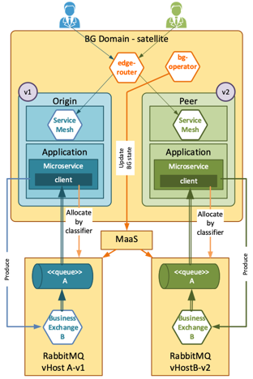
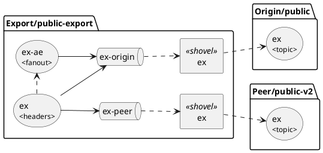

# RabbitMQ blue-green 2 design



MaaS makes dedicated new vhost for every version in bg v2, on the contrary to bg v1, where all RabbitMQ entities were stored in a single vhost. That's why:

* Vhosts are isolated between versions and changes in candidate don't affect active version
* Messages from active version are NOT cloned to candidate, so must be processed in its own version
* Microservice from Origin can't access messages from Peer (and vice versa)
* As in regular scenario, vhost can be reached by MaaS api using classifier with the same name as in Origin and a Peer namespace

## BG operations behavior

* Warmup - during warmup vhost and all its entities (exchanges, queues, bindings) are cloned from Origin to Peer namespace. So if we have vhost with classifier like `{ "name": "my-vhost", "namespace": "origin")`, it will be cloned and new vhost will appear with classifier `{ "name": "my-vhost", "namespace": "peer")`
* Promote and Rollback - these operations don't affect RabbitMQ, because Origin and Peer use their dedicated vhosts and they are isolated from each other
* Commit - operation removes legacy version and returns system to initial state

## RabbitMQ blue-green 2 migration

Since introduction of blue-green version 2 `versionedEntities` concept is deprecated. That means that maas-configuration.yaml must not use `versionedEntities`, just `entities` should be used instead.
If you deployed your application in bg v1 mode, then you need to perform a migration before switching to bg v2.

For example, your current application active version in bg v1 mode is v10:

1. Make rolling update of your active version with `maas-configuration.yaml` changed from `versionedEntities` to `entities`
2. Do operation `Switch to rolling` using deployer (all other candidates and legacy versions would be deleted)
3. Only after that you can switch to bg v2 (using init domain operation)

If you firstly do init-domain and try to rolling update maas-configuration.yaml, then result could be unstable - old versions with versionedEntities could still exists and your warmup will fail.

Consider following RabbitMQ declarative configuration:

```yaml
apiVersion: nc.maas.rabbit/v2
kind: vhost
spec:
  classifier:
    name: demo-vhost
    namespace: ${ENV_NAMESPACE}
  entities:
    exchanges:
      - name: payments
    queues:
      - name: payments-queue
  versionedEntities:
    exchanges:
      - name: quote-changes
    queues:
      - name: quote-changes-queue
```
Here we see two sections with RabbitMQ structure items: entities  and versionedEntities. Bindings were not
declared solely for the sake of simplicity of the provided configuration example.

So, to enable your configuration for Blue/Green v2 you need to move all your entites from `versionedEntites` section
to `entities` section. If you need to save versioned queue names, just add `-v1` suffix to migrated to non-versioned
section queue names. For provided example above, migrated configuration will become:

```yaml
apiVersion: nc.maas.rabbit/v2
kind: vhost
spec:
  classifier:
    name: demo-vhost
    namespace: ${ENV_NAMESPACE}
  entities:
    exchanges:
      - name: payments
      - name: quote-changes
    queues:
      - name: payments-queue
      - name: quote-changes-queue-v1
```


## Exported Vhost

Cloud-Core Blue/Green concept for RabbitMQ implies that for Origin and Peer side used totally independent VHosts. This concept
drastically simplifies update process for VHost either Blue or Green side of domain. But this approach creates difficulties to integrate
with applications deployed outside BG Domain:
- How to handle Warmup event?
- To which VHost should I connect?
- What will be in case of commit event?

## We can solve any problem by introducing an extra level of indirection

To solve problem described above, we introduce additional VHost, that immutable for external client from Blue/Green Domain events
like Warmup/Promote/Rollback/Commit. VHost contains exchanges and queues that was marked as exported in VHost MaaS declaration.

When MaaS found exchange or queue marked as exported, it will create additional VHost. Classifier for new VHost is calculated
using origin classifier by adding suffix `-exported` to `classifier.name` and setting `namespace` to `${ORIGIN_NAMESPACE}`.

Source VHost Classifier:
```yaml
 ...
 classifier:
   name: public
   namespace: ${NAMESPACE}
 ...
```

Exported VHost Classifier:
```yaml
 ...
 classifier:
   name: public-exported
   namespace: ${ORIGIN_NAMESPACE}
 ...
```

## Exported Queues

To export queue just add additional boolean property `exported`:
```yaml
apiVersion: nc.maas.rabbit/v2
kind: vhost
spec:
    classifier:
        name: public
        namespace: ${NAMESPACE}
    entities:
        queues:
        - name: orders
          exported: true
```

MaaS creates VHost for exported queues and start shovel plugin. Shovel plugin moves messages from Origin/Peer VHost queues to exported queue.
```plantuml
skinparam componentStyle rectangle

package Export/public-exported {
  Component "shovel" as origin_shovel
  Component "shovel" as peer_shovel
  queue "order" as ordersExport
  origin_shovel --> ordersExport
  peer_shovel --> ordersExport
}

package a as "Origin/public" {
  queue ordersOrigin as "orders"
  ordersOrigin --> origin_shovel
}
package b as "Peer/public-v2" {
  queue ordersPeer as "orders"
  ordersPeer --> peer_shovel
}

a -[hidden]right- b

```

## Exported Exchange

Just add `exported` boolean field with value `true` to exchange you want to export:
```yaml
apiVersion: nc.maas.rabbit/v2
kind: vhost
spec:
    classifier:
      name: public
      namespace: ${NAMESPACE}
    entities:
        exchanges:
        - name: ex
          exported: false
```

MaaS will create additional VHost with following configuration:

- the name of exported exchange stays intact. `ex` on picture
- in exported vhost, type of published exchange is always `header`. It allows to handle messages by its `version` header
- added alternate exchange for messages without `version` header. The name of alternate exchange is formatted by pattern `{original-exchange-name}-ae`
- there are queues for each version as a temporary buffer to avoid losing messages in case of shovel plugin failure or restarts.

## Client Migration

1. Update VHost configuration and add `exported` property to all entities intended to be export.
2. Upload updated configuration to MaaS.
3. Application that resides outside BG Domain should connect to exported VHost. Application should update classifier for target VHost using pattern:
```yaml
 classifier:
   name: <vhost-classifier-name>-exported
   namespace: <vhost-classifier-namespace>
```
* `vhost-classifier-name` - target vhost `classifier.name` value
* `vhost-classifier-namespace` - `ORIGIN_NAMESPACE` value from target BG Domain

Target queues or exchange names stay intact and doesn't require updates in external Application.

# RabbitMQ requirements

Please note, that described design uses shovel mechanism plugin. That requires enabling `rabbitmq_shovel` in your RabbitMQ broker. `rabbitmq_shovel_management` is optional, but still highly recommended for more convenient UI management.
RabbitMQ docs: https://www.rabbitmq.com/docs/shovel
Example of `rabbitmq-config` config map for kubernetes:

```json
{
	"enabled_plugins": "[rabbitmq_management,rabbitmq_event_exchange,rabbitmq_peer_discovery_k8s,rabbitmq_shovel,rabbitmq_shovel_management].",
	"rabbitmq.conf": ...
}
```